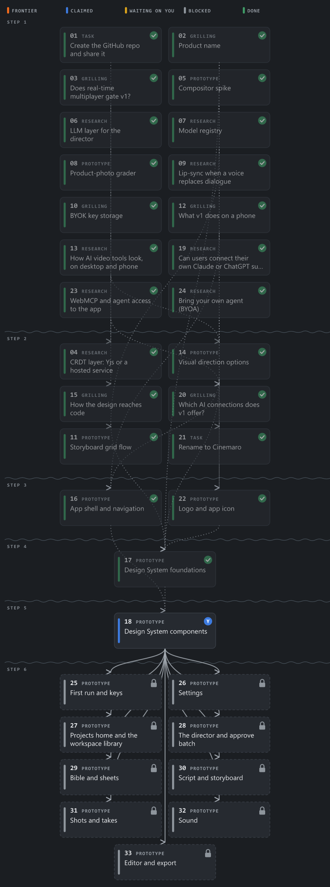
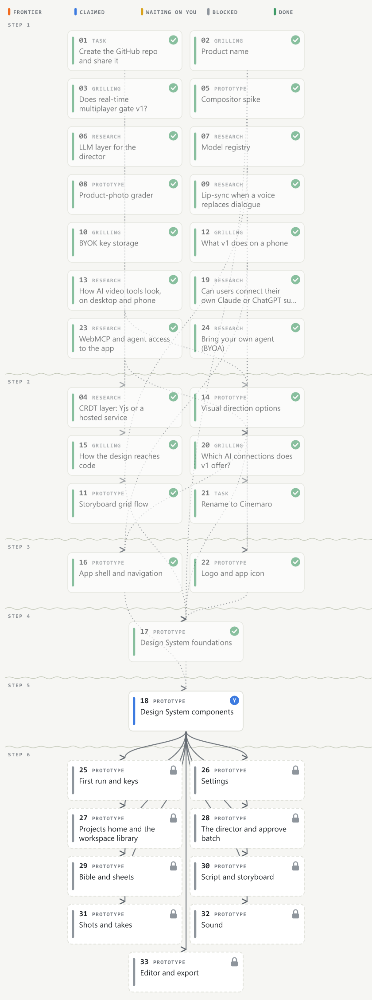

# claude-mods

Mods for [Claude Code](https://claude.com/claude-code), built on the function-hooks plugin API: live panes, bands and hooks that run inside the terminal and the desktop Code tab.

This repo is a plugin marketplace. Add it once, then install any mod from it:

```bash
claude plugin marketplace add Yuvalz19500/claude-mods
claude plugin install wayfinder-maps@claude-mods
```

## Mods

### wayfinder-maps

A side drawer for projects planned with the [`/wayfinder`](https://github.com/mattpocock/skills) skill. Run `/wayfinder-maps` to open it.

- **Shows up when you need it.** In a project with wayfinder maps, a slim band above the prompt sums up what is ready to take and what is waiting on you, with an **Open map drawer** button. It stays out of the way everywhere else.
- **Every map in the project.** Each map shows its status (open, in progress, done, graduated to a spec), how many tickets are done, and how many are frontier, claimed, waiting on you or blocked.
- **Maps and specs.** Wayfinder maps hold decision tickets. Graduated specs (a `spec.md` beside numbered implementation tickets) appear in their own section and are drawn the same way.
- **A trail map of the tickets.** Click a map to see its dependency graph. Tickets are set out in steps, each one below the tickets that block it. Trails stay solid while a blocker is still open and turn dotted once it's done. Frontier tickets (open, unblocked, unclaimed) carry an orange pennant.
- **Ticket details.** Click a ticket in the tree to read its question and answer (or the issue and its comments), see what blocks it, open the file or issue, or press **Work this ticket** to start a session on it.
- **Filters.** Show all tickets, only unresolved ones, or only the frontier.

| Dark | Light |
| --- | --- |
|  |  |

**Where it looks**

| Tracker | What it reads |
| --- | --- |
| Local markdown | Any folder (up to 4 levels deep) holding `map.md` or `spec.md` beside an `issues/` or `tickets/` folder of `NN-slug.md` files: `.scratch/<effort>/`, `docs/wayfinder/<effort>/` and the like. Each ticket's `Type:`, `Status:`, `Assignee:` and `Blocked by:` lines (plain or `**bold**`, inline or as a list). |
| GitHub | Issues labelled `wayfinder:map` in the session's repo, their sub-issues as tickets, and GitHub's native blocked-by dependencies. Falls back to a task list in the map body and `Blocked by: #n` lines. Needs the `gh` CLI, signed in. |

Status words are folded into five states. `resolved`, `done` and closed issues are done. `claimed`, or any assignee on an open ticket, is claimed. `awaiting-design` and `ready-for-human` are waiting on you. An open ticket with an unfinished blocker is blocked. Everything else open (`open`, `ready-for-agent`) is frontier.

The drawer refreshes after every turn and every 30 seconds while it's open. GitHub is fetched at most once a minute; press **Refresh** to fetch now.

**Settings**

The prompts the buttons send can be changed under `/config` (or `pluginConfigs` in settings):

| Option | Default |
| --- | --- |
| `mapPrompt` | `/wayfinder {map}` |
| `mapTicketPrompt` | `/wayfinder {map} {ticket}` |
| `specTicketPrompt` | `/implement {ticket}` |

`{map}` is the map's path or issue URL, `{ticket}` the ticket's path or issue URL, `{title}` its title.

## Developing a mod

Each mod is a folder under `plugins/` with `.claude-plugin/plugin.json`, `hooks/hooks.json` and a hooks module. Check one with:

```bash
claude plugin validate plugins/<mod>
```

Load a working copy into a session with `claude --plugin-dir plugins/<mod>`; it hot-reloads on save. Add the mod to `.claude-plugin/marketplace.json` to publish it.
